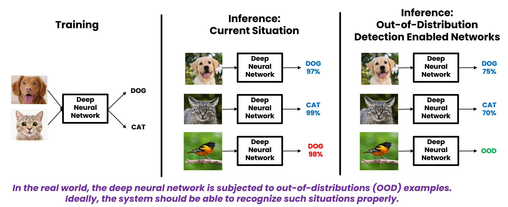
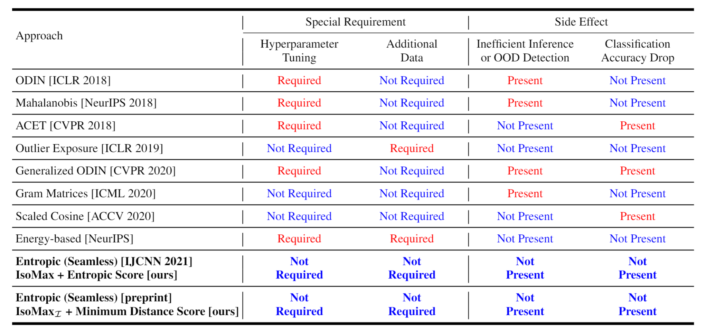
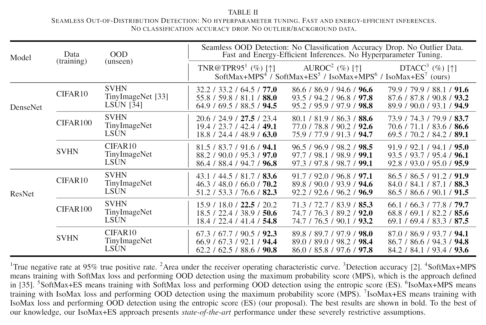
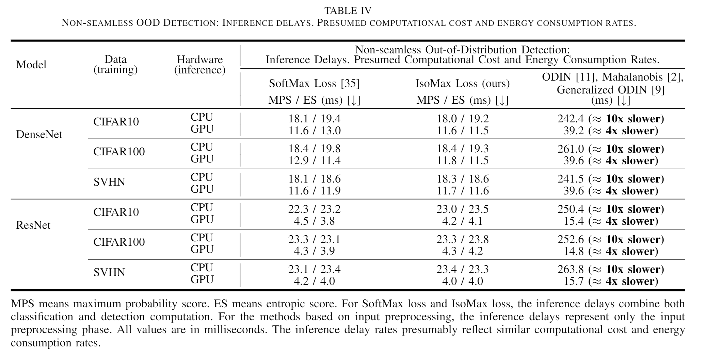
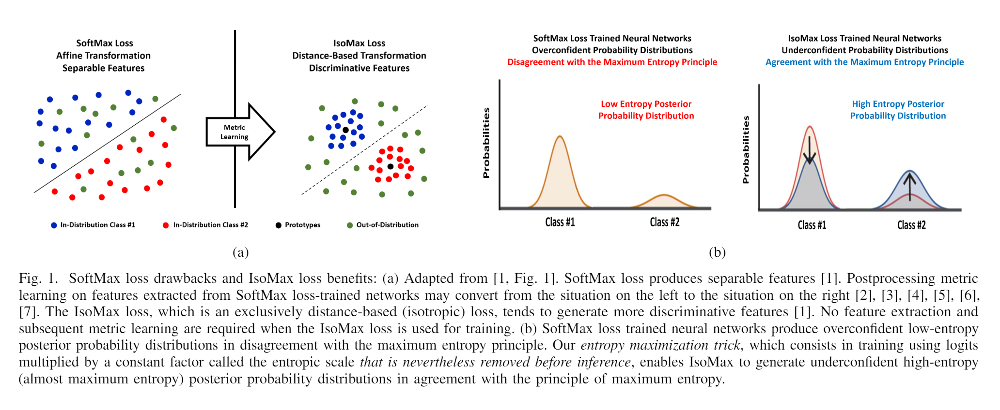
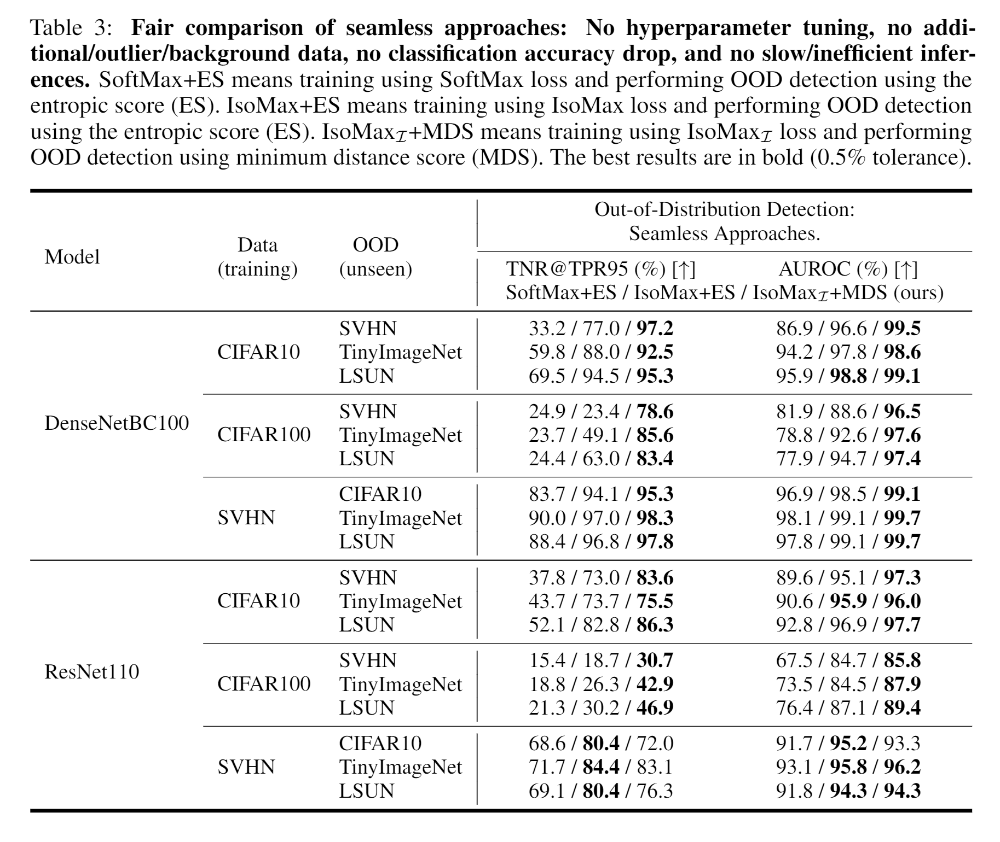
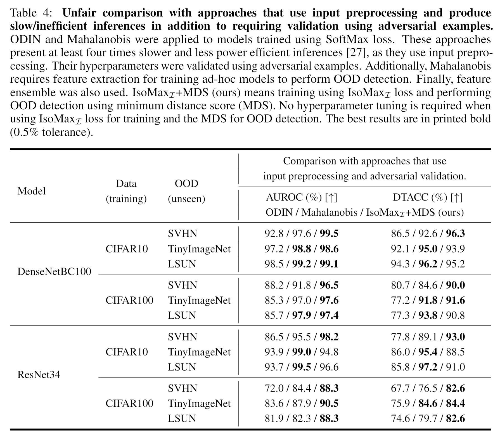
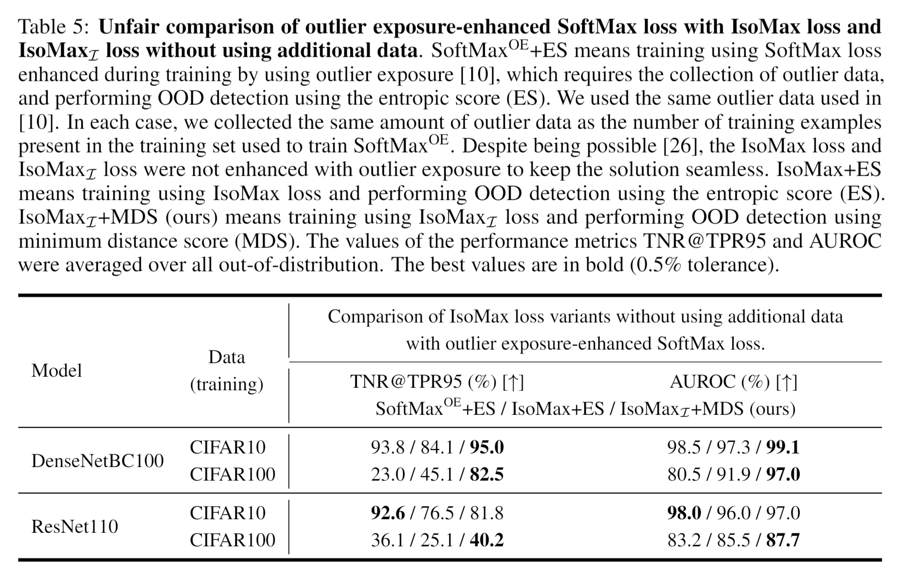
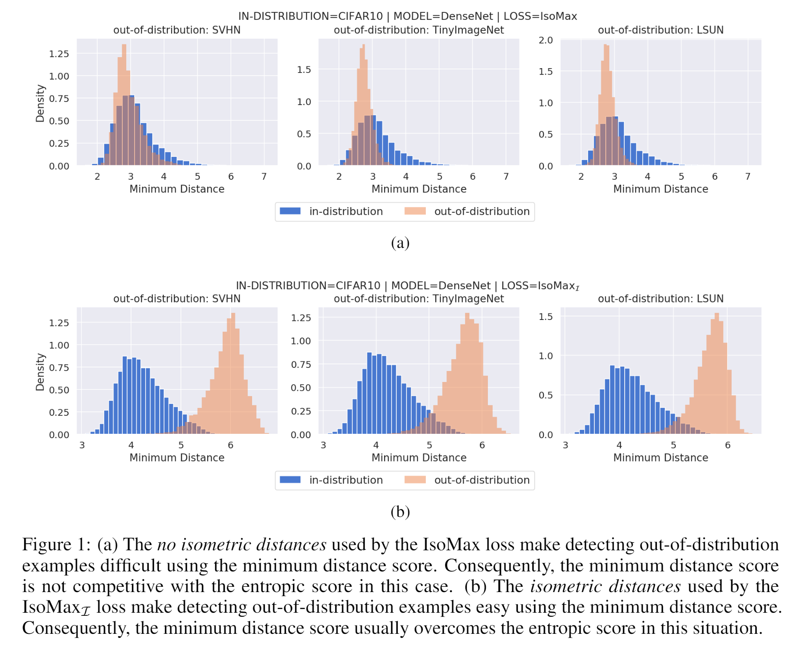

# Entropic Out-of-Distribution Detection



We call our approach seamless because it neither presents special requirements (e.g., hyperparameter tuning, additional data) nor produces side effects (e.g., inefficient inference or out-of-distribution detection, classification accuracy drop). Our approach consists of a loss that works as a drop-in replacement to the SoftMax loss (i.e., the combination of the SoftMax activation and the cross-entropy loss). The out-of-distribution detection is performed using an efficient score.



# Papers

## Entropic Out-of-Distribution Detection (IJCNN 2021)

The paper "[Entropic Out-of-Distribution Detection](https://arxiv.org/abs/1908.05569)" (IJCNN 2021) proposes the IsoMax loss, which works as a drop-in replacement of the SoftMax loss. The solution is seamless. Hence, it does not produce classification accuracy drop while significantly improves the OOD detection performance. Additionally, unlike other OOD detection approaches, IsoMax loss delivers inferences as fast and energy-efficient as SoftMax loss-trained neural networks. Our solution does not require hyperparameter tuning. No additional data are needed. Finally, the out-of-distribution detection is performed using the speedy entropic score. 







## Improving Entropic Out-of-Distribution Detection using Isometric Distances and the Minimum Distance Score (preprint)

The paper "[Improving Entropic Out-of-Distribution Detection using Isometric Distances and the Minimum Distance Score](https://arxiv.org/abs/2105.14399)" proposes the Isometric IsoMax loss that significantly improved the out-of-distribution detection performance relative to IsoMax loss while also keeping the solution seamless. Besides enhanced results, the Isometric IsoMax loss also works as a SoftMax loss drop-in replacement. The minimum distance score is used rather than the entropic score.

>>**From now on, please use the Isometric IsoMax loss combined with the minimum distance score rather than the IsoMax loss combined with the entropic score.**









# Code

## Software Requirements

Much code reused from "[deep_Mahalanobis_detector](https://github.com/pokaxpoka/deep_Mahalanobis_detector)" and [odin-pytorch](https://github.com/facebookresearch/odin).

* [Pytorch](http://pytorch.org/)
* [TorchVision](https://github.com/pytorch/vision)
* [TorchNet](https://github.com/pytorch/tnt)
* [TorchMetrics](https://github.com/PyTorchLightning/metrics)
* [Numpy](https://www.numpy.org/)
* [Pandas](https://pandas.pydata.org/)
* [Scikit-Learn](https://scikit-learn.org/stable/)
* [TQDM](https://github.com/tqdm/tqdm)

## Downloading Out-of-Distribution Data

### We used download links of two out-of-distribution datasets from [odin-pytorch](https://github.com/facebookresearch/odin):

* [Tiny-ImageNet (resize)](https://www.dropbox.com/s/kp3my3412u5k9rl/Imagenet_resize.tar.gz)
* [LSUN (resize)](https://www.dropbox.com/s/moqh2wh8696c3yl/LSUN_resize.tar.gz)

### Place the above files to a folder called `data` and run the following commands in the mentioned directory:

```
tar xvf Imagenet_resize.tar.gz
tar xvf LSUN_resize.tar.gz
```

## Reproducing Experiments

### Train the models and evaluate the out-of-distribution detection performance:

```
./run_cifar10.sh
./run_cifar100.sh
./run_svhn.sh
```

## Analizing Results

### Print the experiment results:

```
./analize.sh ood
```

___

# Add out-of-distribution detection to your project!!!

## Replace the SoftMax loss with the IsoMax loss changing two lines of code!!!

### Replace the model classifier last layer with the Isometric IsoMax loss first part:

```python
class Model(nn.Module):
    def __init__(self):
    (...)
    #self.classifier = nn.Linear(num_features, num_classes)
    self.classifier = losses.IsoMaxIsometricLossFirstPart(num_features, num_classes)
```

### Replace the criterion by the Isometric IsoMax loss second part:

```python
model = Model()
#criterion = nn.CrossEntropyLoss()
criterion = losses.IsoMaxIsometricLossSecondPart(model.classifier)
```

## Detect using the minimum distance score:

```python
outputs = model(inputs)
# outputs are equal to logits, which in turn are equivalent to negative distances
score = outputs.max(dim=1)[0] # this is the minimum distance score
# the minimum distance score is the best option for the Isometric IsoMax loss
```

## Run the example:

```
python example.py
```
