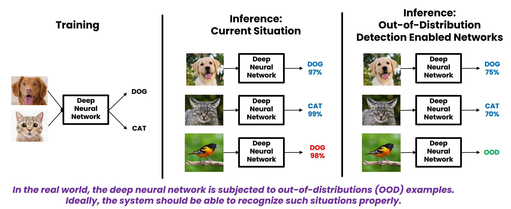
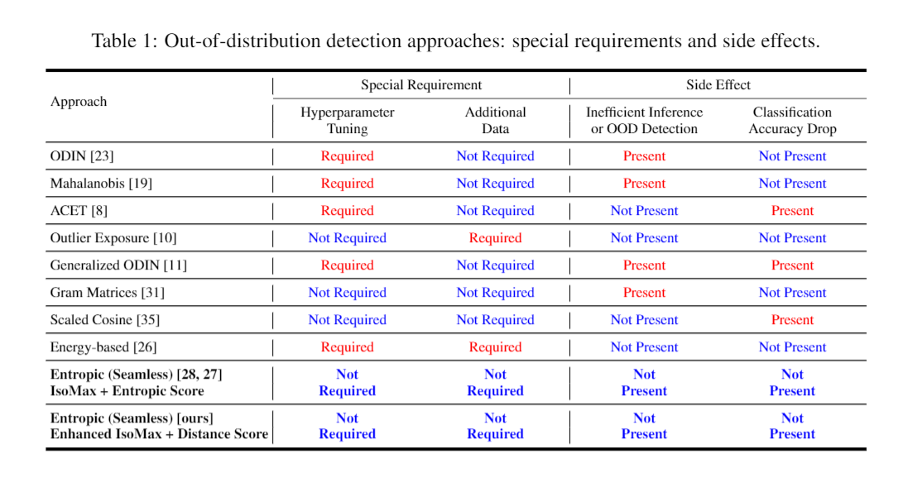
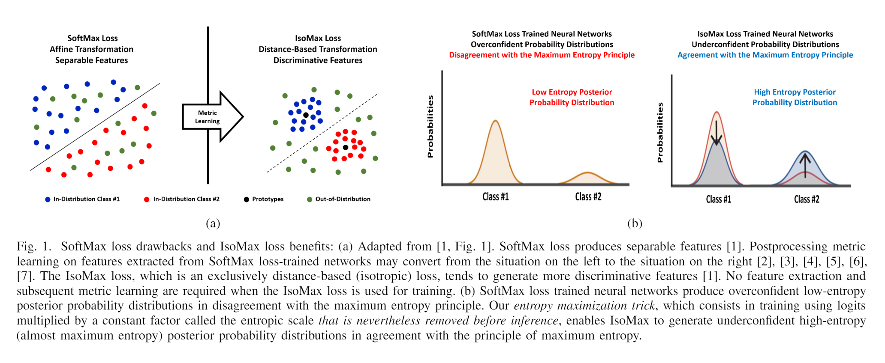
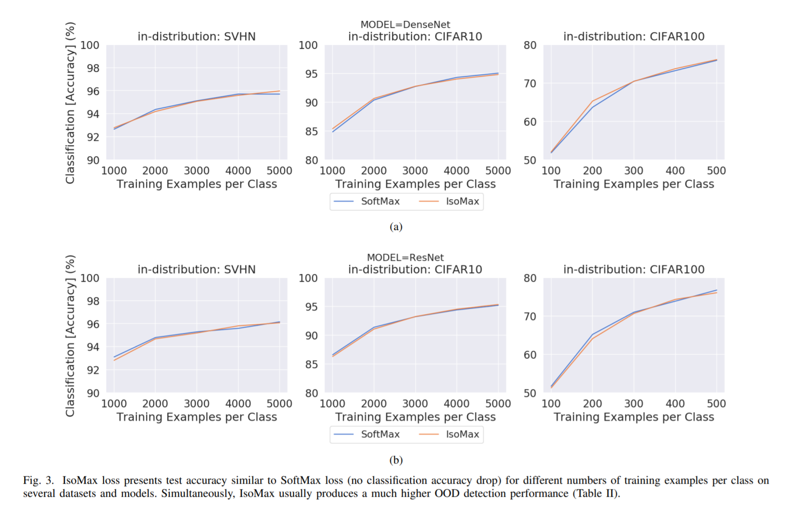
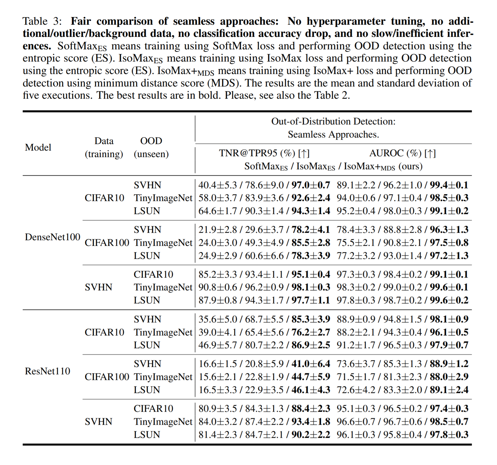
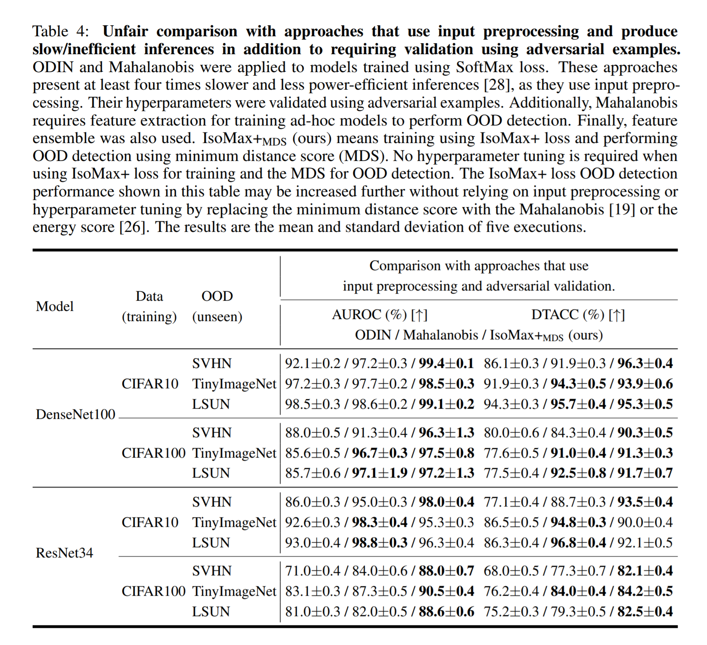
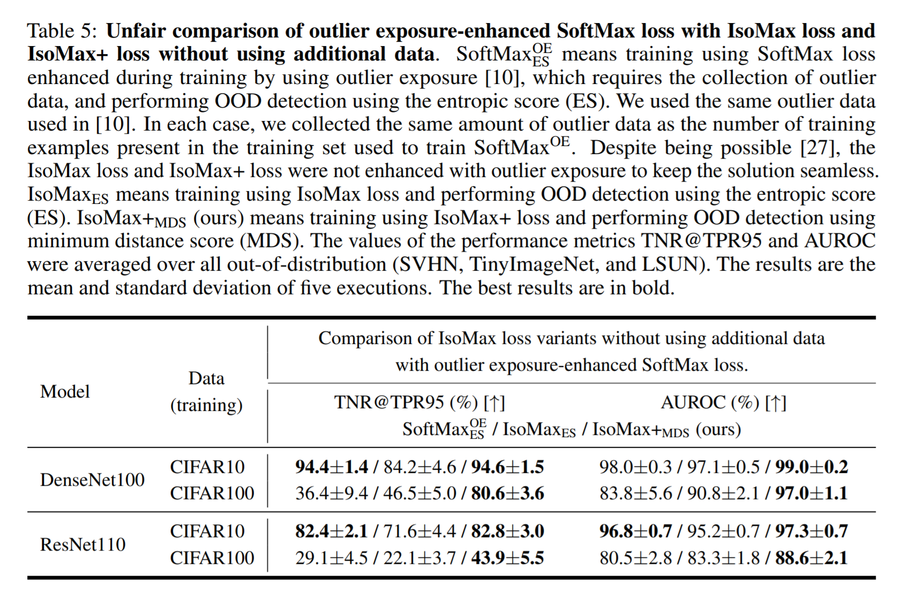
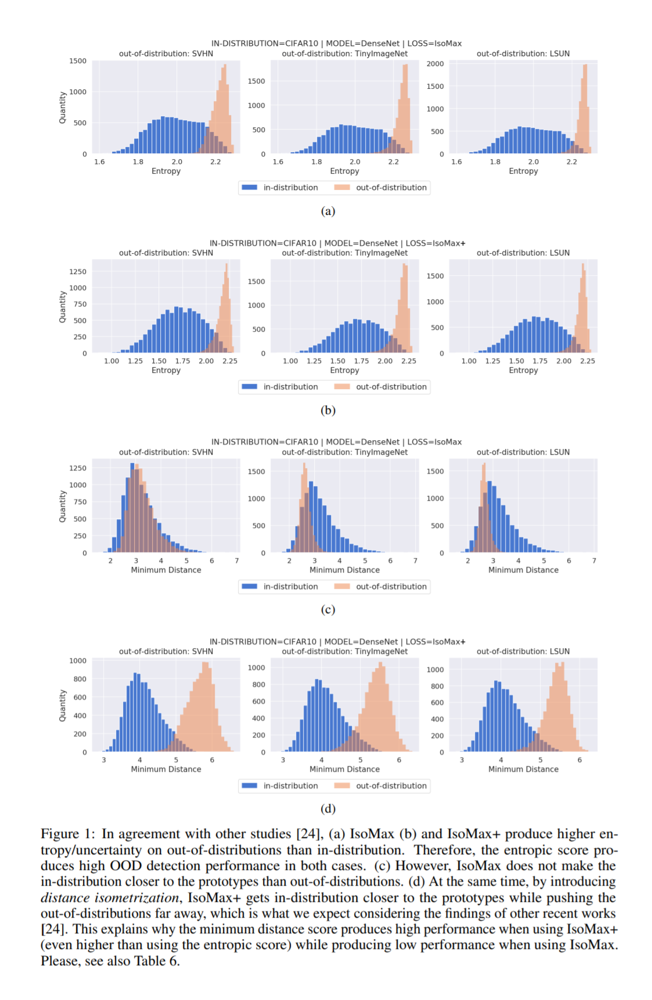

## **Visit the repository of our newest work:**

## **[Distinction Maximization Loss: Efficiently Improving Classification Accuracy, Uncertainty Estimation, and Out-of-Distribution Detection Simply Replacing the Loss and Calibrating](https://github.com/dlmacedo/distinction-maximization-loss)**

# Entropic Out-of-Distribution Detection



>>**We call our approach seamless because it neither presents special requirements (e.g., hyperparameter tuning, additional data) nor produces side effects (e.g., inefficient inference or detection, classification accuracy drop).**

>>**Our approach consists of a loss that works as a drop-in replacement to the SoftMax loss (i.e., the combination of the output linear layer, the SoftMax activation, and the cross-entropy loss). The out-of-distribution detection is performed using a zero computational cost score.**

 >>**Besides all the above, the IsoMax+ loss (the most recent version) produces state-of-the-art out-of-distribution detection performance.**



___

# Add seamless and high-performance out-of-distribution detection to your project!!!

## Replace the SoftMax loss with the IsoMax+ loss changing two lines of code.

### Replace the model classifier last layer with the IsoMax+ loss first part:

```python
class Model(nn.Module):
    def __init__(self):
    (...)
    #self.classifier = nn.Linear(num_features, num_classes)
    self.classifier = losses.IsoMaxPlusLossFirstPart(num_features, num_classes)
```

### Replace the criterion by the IsoMax+ loss second part:

```python
#criterion = nn.CrossEntropyLoss()
criterion = losses.IsoMaxPlusLossSecondPart()
```

## Detect using the minimum distance score:

```python
outputs = model(inputs)
# outputs are equal to logits, which in turn are equivalent to negative distances
score = outputs.max(dim=1)[0] # this is the minimum distance score for detection
# the minimum distance score is the best option for the IsoMax+ loss
```

## Run the example:

```
python example.py
```
___

# Code

## Software requirements

Much code reused from "[deep_Mahalanobis_detector](https://github.com/pokaxpoka/deep_Mahalanobis_detector)" and [odin-pytorch](https://github.com/facebookresearch/odin).

### Please, install all package requirments runing the command bellow:

```bash
pip install -r requirements.txt
```

## Preparing the data

### Please, move to the `data` directory and run all the prepare data bash scripts:

```bash
./prepare-cifar.sh # downloads out-of-distrbution data for CIFAR datasets.
```

## Reproducing Experiments

### Train the models and evaluate the out-of-distribution detection performance:

```
./run_cifar10.sh
./run_cifar100.sh
./run_svhn.sh
```

## Analizing Results

### Print the experiment results:

```
./analize.sh
```

# Papers

## Entropic Out-of-Distribution Detection (IJCNN 2021)

The paper "Entropic Out-of-Distribution Detection" [(arXiv)](https://arxiv.org/abs/1908.05569) [(IJCNN 2021)](https://ieeexplore.ieee.org/document/9533899) proposes the IsoMax loss, which works as a drop-in replacement of the SoftMax loss. The solution is seamless. Hence, it does not produce classification accuracy drop while significantly improves the OOD detection performance. Additionally, unlike other OOD detection approaches, IsoMax loss delivers inferences as fast and energy-efficient as SoftMax loss-trained neural networks. Our solution does not require hyperparameter tuning. No additional data are needed. Finally, the out-of-distribution detection is performed using the speedy entropic score. 



## Entropic Out-of-Distribution Detection: Seamless Detection of Unknown Examples (IEEE TNNLS 2021)

The paper "Entropic Out-of-Distribution Detection: Seamless Detection of Unknown Examples" [(arXiv)](https://arxiv.org/abs/2006.04005) [(IEEE TNNLS 2021)](https://ieeexplore.ieee.org/document/9556483) is the journal version of the paper "Entropic Out-of-Distribution Detection". It presents additional explanations, experiments, and analyses regarding the IsoMax loss. 



## Enhanced Isotropy Maximization Loss: Seamless and High-Performance Out-of-Distribution Detection Simply Replacing the SoftMax Loss

The paper "Enhanced Isotropy Maximization Loss: Seamless and High-Performance Out-of-Distribution Detection Simply Replacing the SoftMax Loss" [(arXiv)](https://arxiv.org/abs/2105.14399) proposes the Enhanced IsoMax (IsoMax+) loss that significantly improved the out-of-distribution detection performance relative to IsoMax loss while also keeping the solution seamless. The minimum distance score is used rather than the entropic score. Besides being seamless and easy to implement and use, this solution produces competitive state-of-the-art out-of-distribution detection results.

>>**From now on, use the IsoMax+ loss combined with the minimum distance score rather than the IsoMax loss combined with the entropic score.**









# Citation

Please, cite our papers if you use our losses in your works:

```bibtex
@INPROCEEDINGS{9533899,
  author={Macêdo, David and Ren, Tsang Ing and Zanchettin, Cleber and Oliveira, Adriano L. I. and Ludermir, Teresa},
  booktitle={2021 International Joint Conference on Neural Networks (IJCNN)}, 
  title={Entropic Out-of-Distribution Detection}, 
  year={2021},
  volume={},
  number={},
  pages={1-8},
  doi={10.1109/IJCNN52387.2021.9533899}}
```

```bibtex
@ARTICLE{9556483,
  author={Macêdo, David and Ren, Tsang Ing and Zanchettin, Cleber and Oliveira, Adriano L. I. and Ludermir, Teresa},
  journal={IEEE Transactions on Neural Networks and Learning Systems}, 
  title={Entropic Out-of-Distribution Detection: Seamless Detection of Unknown Examples}, 
  year={2022},
  volume={33},
  number={6},
  pages={2350-2364},
  doi={10.1109/TNNLS.2021.3112897}}
```

```bibtex
@misc{macêdo2021seamless,
      title={Enhanced Isotropy Maximization Loss: Seamless and High-Performance Out-of-Distribution Detection Simply Replacing the SoftMax Loss}, 
      author={David Macêdo and Teresa Ludermir},
      year={2021},
      eprint={2105.14399},
      archivePrefix={arXiv},
      primaryClass={cs.LG}
}
```
